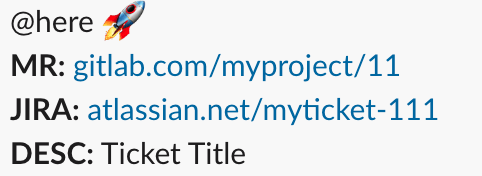

<div align="center">
	
	<h1><b>Pullb0t</b></h1>
	<p><b>A bot for posting new Gitlab Merge requests to a Slack Webhook with automatic JIRA integration</b></p>
  <p>Developed with ❤️ by <a href="https://cloudcall.com">CloudCall</a></p>
	</br>
	</br>
</div>

## Features
- Automatically detect JIRA ticket numbers in the branch name or commit message
- Post all new non-WIP merge requests to a given Slack Webhook URL

## Setup

### Environment Variables
The bot requires a few config options. Here's how to get them

#### JIRA Details
It is recommended you create a new "bot" user account and assign it global admin privileges (so it can view all boards)
```
JIRA_URL="company.atlassian.net" - Note the lack of the http/https!
JIRA_USERNAME="bot" - the JIRA username used to query the API
JIRA_PASSWORD="password" - the JIRA password for the above user
```

#### Slack
1. Add the "Incoming Webhook" integration
2. Add a new configuration - setup where the webhook messages will go, and the user they will be posted as
3. Copy the "Webhook URL" on the page

#### Gitlab
```
GITLAB_URL="https://git.company.gitlab.com" - Just the URL for your git instance
```

### Standard
1. Clone the project - `$ git clone https://github.com/joshghent/pullb0t.git`
2. Copy of the `.env.example` file and fill in the details
3. Run `npm start`!

### Docker
```bash
docker run -d --restart always \ --name pullb0t \
  --env JIRA_URL="company.atlassian.net" \
  --env JIRA_USERNAME="botuser" \
  --env JIRA_PASSWORD="password" \
  --env SLACK_WEBHOOK_URL="HOOK_URL" \
  --env GITLAB_URL="GITLAB_URL" -p 1337:3000  joshghent/pullb0t:latest
```

## Bugs
Please create a new issue [here](https://github.com/joshghent/pullb0t/issues/new)

## License
MIT - CloudCall

## Author
[Josh Ghent](https://github.com/joshghent) on behalf of [CloudCall](https://cloudcall.com)
